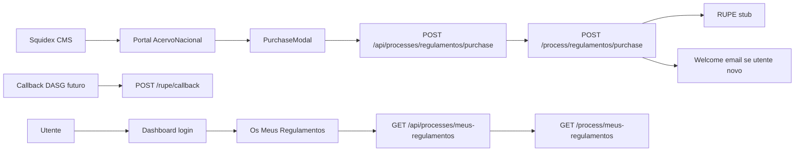

# Integração — Acervo Nacional Regulamentar

Guia para ligar o portal e o dashboard à API Nest de compra de Regulamentos Técnicos.

**Estado actual:** o backend está pronto; o portal ainda gera RUPE localmente (`generateRupe`) e o dashboard ainda não tem “Os Meus Regulamentos”.

---

## Decisões de autenticação (obrigatórias)

| Superfície | Auth | Responsabilidade |
|------------|------|------------------|
| **Portal** (`frontend`) | **Nenhuma** | Catálogo CMS, formulário de compra, mostrar referência RUPE |
| **Dashboard** (`dashboard`) | **Login JWT** | Histórico de compras e download dos PDFs pagos |
| **Role `UTENTE`** | Restrito (`isStaff === false`) | Só vê os **próprios** regulamentos; sem fila, admin, confirmação RUPE staff |

- A compra **nunca** cria sessão no portal (não chamar `setToken`).
- Se o e-mail for novo, o Nest cria o utente e envia **welcome credentials** por e-mail — essas credenciais servem para login no **dashboard**.
- Após pagamento confirmado (callback), o Nest envia e-mail de aquisição; o download fica disponível em “Os Meus Regulamentos” no dashboard.

---

## Visão geral do fluxo



1. Utente consulta o catálogo no portal (dados Squidex).
2. Clica **Comprar** → preenche Entidade, NIF, Telefone, E-mail.
3. Portal chama o BFF → Nest gera processo + RUPE automaticamente.
4. Portal mostra a referência RUPE e orienta a pagar; após pagamento, aceder ao dashboard.
5. Serviço de pagamento (ou stub em dev) confirma via `POST /rupe/callback`.
6. Utente faz login no dashboard e descarrega em **Os Meus Regulamentos**.

---

## Contratos da API

### Compra (portal — público)

| Camada | Endpoint |
|--------|----------|
| Portal → BFF | `POST /api/processes/regulamentos/purchase` |
| BFF → Nest | `POST /process/regulamentos/purchase` (`auth: false`) |

**Request body:**

```json
{
  "entityName": "Empresa Regulamentos Lda",
  "entityNif": "5001234567",
  "email": "regulamentos@exemplo.ao",
  "phone": "+244900000000",
  "regulamento": {
    "cmsId": "cms-content-id",
    "code": "RT-001",
    "title": "Regulamento Técnico de Exemplo",
    "areaTecnica": "Construção",
    "estado": "em vigor",
    "price": 15000,
    "documentUrl": "https://cms.exemplo.ao/docs/rt-001.pdf"
  }
}
```

**Mapeamento formulário / CMS → Nest:**

| FE / CMS | API Nest |
|----------|----------|
| `entidade` | `entityName` |
| `nif` | `entityNif` |
| `telefone` | `phone` |
| `email` | `email` |
| `code` (CMS `reference`) | `regulamento.code` |
| `title` | `regulamento.title` |
| `areaTecnica` | `regulamento.areaTecnica` |
| `estado` | `regulamento.estado` |
| `price` | `regulamento.price` |
| `documentUrl` | `regulamento.documentUrl` |
| id CMS | `regulamento.cmsId` |

**Resposta (campos relevantes):**

```json
{
  "process": { "id": "...", "referenceNumber": "RT-2026-000001", "status": "RUPE_PENDENTE" },
  "referenceNumber": "RT-2026-000001",
  "regulamento": { "code": "RT-001", "title": "...", "price": 15000 },
  "rupe": {
    "reference": "RUPE-1710000000000",
    "value": "15000",
    "status": "PENDING",
    "expireAt": "2026-08-12T00:00:00.000Z"
  },
  "totalAmount": 15000
}
```

Usar `rupe.reference` no ecrã de sucesso (não `generateRupe` local).

### Histórico / download (dashboard — JWT)

| Camada | Endpoint |
|--------|----------|
| Dashboard → BFF | `GET /api/processes/meus-regulamentos` |
| BFF → Nest | `GET /process/meus-regulamentos` (Bearer via cookie `iniq_token`) |

**Resposta (lista):**

```json
[
  {
    "id": "...",
    "referenceNumber": "RT-2026-000001",
    "status": "PAGAMENTO_CONFIRMADO",
    "createdAt": "...",
    "rupe": {
      "reference": "RUPE-1710000000000",
      "value": "15000",
      "status": "PAID",
      "expireAt": "...",
      "paidAt": "..."
    },
    "regulations": [
      {
        "id": "...",
        "cmsId": "...",
        "code": "RT-001",
        "title": "...",
        "areaTecnica": "Construção",
        "estado": "em vigor",
        "price": "15000",
        "documentUrl": "https://cms.exemplo.ao/docs/rt-001.pdf",
        "downloadAvailable": true
      }
    ]
  }
]
```

- `documentUrl` só vem preenchido quando `status === PAGAMENTO_CONFIRMADO` e RUPE `PAID`.
- Mostrar botão de download apenas se `downloadAvailable === true`.
- A API filtra por `userId` do JWT — o utente só vê as suas compras.

### Callback de pagamento (não é UI)

| Quem | Endpoint |
|------|----------|
| Serviço DASG (futuro) / stub em dev | `POST {{backendUrl}}/rupe/callback` |

```json
{
  "reference": "RUPE-1710000000000",
  "status": "PAID"
}
```

**Não** chamar este endpoint a partir do browser em produção. Em desenvolvimento, usar Postman/curl após a compra.

Alternativa staff (já existente): `POST /rupe/confirm-payment/:processId` (JWT `TECNICO_RECECAO` | `ADMIN`) — **não** disponível a `UTENTE`.

---

## Checklist de implementação

### A. Portal (`frontend`) — sem auth

#### 1. BFF de compra

Criar [`frontend/server/api/processes/regulamentos/purchase.post.ts`](../../../../server/api/processes/regulamentos/purchase.post.ts):

```ts
import { backendFetch } from '../../../utils/backend'

export default defineEventHandler(async (event) => {
  const body = await readBody(event)

  return backendFetch(event, '/process/regulamentos/purchase', {
    method: 'POST',
    body,
    auth: false,
  })
})
```

- Espelhar o padrão de [`dashboard/.../normalizacao/purchase.post.ts`](../../../../../dashboard/server/api/processes/normalizacao/purchase.post.ts).
- **Não** chamar `setToken` — o portal permanece sem sessão.

#### 2. Map CMS — incluir `cmsId`

Em [`app/pages/registo-cadastro.vue`](../../../pages/registo-cadastro.vue), o map actual:

```ts
(acervoNacionalData.value?.data?.queryRegulationsContents || []).map((item: any) => {
  const d = item.data
  return {
    code: d.reference,
    title: d.title,
    areaTecnica: d.category?.[0]?.flatData?.title || "",
    estado: (d.estado || "Em vigor").toLowerCase(),
    price: d.price || 0,
    documentUrl: d.document?.[0]?.url || "",
  }
})
```

Acrescentar `cmsId` (id Squidex do content). Ajustar a query GraphQL em [`app/gql/regulamentos/acervoNacional.gql`](../../../gql/regulamentos/acervoNacional.gql) se for necessário expor o `id` no nível do content (ex.: `id` fora de `flatData`).

#### 3. `PurchaseModal.vue`

Ficheiro: [`PurchaseModal.vue`](./PurchaseModal.vue)

- Remover `import { generateRupe } from "@/utils/rupe"`.
- No submit, chamar:

```ts
const response = await $fetch("/api/processes/regulamentos/purchase", {
  method: "POST",
  body: {
    entityName: formData.value.entidade.trim(),
    entityNif: formData.value.nif.trim(),
    phone: formData.value.telefone.trim(),
    email: formData.value.email.trim(),
    regulamento: {
      cmsId: props.item?.cmsId,
      code: props.item?.code,
      title: props.item?.title,
      areaTecnica: props.item?.areaTecnica,
      estado: props.item?.estado,
      price: Number(props.item?.price ?? 0),
      documentUrl: props.item?.documentUrl || undefined,
    },
  },
})
```

- Guardar `response.rupe.reference` (e opcionalmente `response.referenceNumber`) para o ecrã de sucesso.
- Estados: `isSubmitting`, `submitError` — mesmo padrão de erro que [`RegistroCadastro.vue`](./RegistroCadastro.vue) (`statusMessage`).
- Texto de sucesso: indicar o RUPE, o valor, e que **após o pagamento** o utente deve entrar no **dashboard** (e-mail usado na compra; password no e-mail de boas-vindas se conta nova) para histórico e download.

#### 4. `AcervoNacional.vue` — sem download público

Ficheiro: [`AcervoNacional.vue`](./AcervoNacional.vue)

- Remover o link “Descarregar documento (PDF)” do catálogo (hoje usa `regulamento.documentUrl` antes do pagamento).
- O PDF só fica disponível no dashboard depois de `PAGAMENTO_CONFIRMADO`.

Manter: código, título, área técnica, estado, preço, botão **Comprar**.

---

### B. Dashboard — auth + UTENTE restrito

#### 5. BFF histórico

Criar [`dashboard/server/api/processes/meus-regulamentos.get.ts`](../../../../../dashboard/server/api/processes/meus-regulamentos.get.ts):

```ts
import { backendFetch } from '~~/server/utils/backend'

export default defineEventHandler(async (event) => {
  return backendFetch(event, '/process/meus-regulamentos', {
    method: 'GET',
    auth: true,
  })
})
```

#### 6. Página “Os Meus Regulamentos”

- Criar página (ex.: `dashboard/app/pages/regulamentos/index.vue`) protegida pelo middleware global de auth.
- Em `onMounted` / `useAsyncData`: `$fetch('/api/processes/meus-regulamentos')`.
- Listar compras: código, título, estado do processo/RUPE, data.
- Se `regulation.downloadAvailable` e `documentUrl`: botão/link “Descarregar”.
- Se pendente de pagamento: indicar “Aguardando confirmação de pagamento” (sem link do PDF).

#### 7. Navegação

Em [`dashboard/app/layouts/default.vue`](../../../../../dashboard/app/layouts/default.vue):

- Adicionar link **Os Meus Regulamentos** (`to: '/regulamentos'`) visível para utente (e staff se fizer sentido).
- **Não** expor a `UTENTE`: Fila de análise, Utilizadores, confirmação RUPE admin — já filtrados por `isStaff` em [`useAuth`](../../../../../dashboard/app/composables/useAuth.ts).

#### 8. Permissões `UTENTE`

| Pode | Não pode |
|------|----------|
| Login no dashboard | Aceder a `/fila` e rotas com `middleware: staff` |
| Ver “Os Meus Regulamentos” (só os seus) | Confirmar pagamento RUPE (`confirm-payment`) |
| Descarregar PDFs pagos | Gerir utilizadores / definições de membros |
| Ver “Os meus processos” | Acções administrativas de workflow staff |

Referência: [`staff.ts`](../../../../../dashboard/app/middleware/staff.ts) redirecciona não-staff para `/`.

#### 9. Labels e tipos

Em [`dashboard/app/constants/labels.ts`](../../../../../dashboard/app/constants/labels.ts) e tipos em [`dashboard/app/types/api.ts`](../../../../../dashboard/app/types/api.ts):

- Incluir `REGULAMENTOS_TECNICOS: 'Regulamentos Técnicos'` em `SERVICE_TYPE_LABELS` / union `ServiceType`.

#### 10. Teste local do callback (stub)

Após uma compra bem-sucedida:

```bash
curl -X POST http://localhost:3000/rupe/callback \
  -H "Content-Type: application/json" \
  -d "{\"reference\":\"RUPE-...\",\"status\":\"PAID\"}"
```

(Substituir host/porta e referência pelos valores reais do ambiente.)

Depois: login no dashboard com o e-mail da compra → **Os Meus Regulamentos** → download.

---

## UX — mensagens sugeridas

**Sucesso no portal (após compra):**

> RUPE gerado com sucesso: `{rupe.reference}`.  
> Efectue o pagamento de `{totalAmount}` AOA.  
> Após a confirmação automática do pagamento, aceda ao dashboard INIQ com este e-mail para consultar e descarregar o regulamento em “Os Meus Regulamentos”.  
> Se for a primeira compra com este e-mail, as credenciais foram enviadas por mensagem.

**Catálogo:** não mostrar PDF gratuito.

**Dashboard — pendente:** “Pagamento por confirmar”.  
**Dashboard — pago:** botão “Descarregar PDF”.

---

## Critérios de aceitação

- [ ] Lista completa no portal (CMS): Código, Título, Área técnica, Estado, Comprar — **sem** download pré-pagamento.
- [ ] Formulário: Entidade, NIF, Telefone, E-mail → RUPE real da API.
- [ ] Portal **sem** login / cookie / área de histórico.
- [ ] Após callback: e-mail de aquisição (backend) + `documentUrl` disponível na API.
- [ ] Login no dashboard como `UTENTE` → Os Meus Regulamentos → download.
- [ ] `UTENTE` não acede a funções staff (fila, membros, confirm-payment).

---

## Fora de âmbito deste guia

- Integração real DASG / HMAC do callback.
- Alterações ao backend Nest (endpoints já existem).
- Auth no portal público.
- Sincronizar inventário CMS para o Nest (o Nest guarda apenas o snapshot na compra).

---

## Referências rápidas

| Recurso | Caminho |
|---------|---------|
| Catálogo CMS (GQL) | `frontend/app/gql/regulamentos/acervoNacional.gql` |
| Map + página | `frontend/app/pages/registo-cadastro.vue` |
| UI catálogo | `frontend/app/components/custom/arcrt/AcervoNacional.vue` |
| Modal compra | `frontend/app/components/custom/arcrt/PurchaseModal.vue` |
| BFF portal (padrão) | `frontend/server/utils/backend.ts` |
| BFF dashboard (padrão) | `dashboard/server/utils/backend.ts` |
| Auth dashboard | `dashboard/app/composables/useAuth.ts` |
| API Nest (docs) | `backend/docs/API-GUIDE.md` (secção Regulamentos Técnicos) |
| Compra Nest | `POST /process/regulamentos/purchase` |
| Histórico Nest | `GET /process/meus-regulamentos` |
| Callback Nest | `POST /rupe/callback` |
